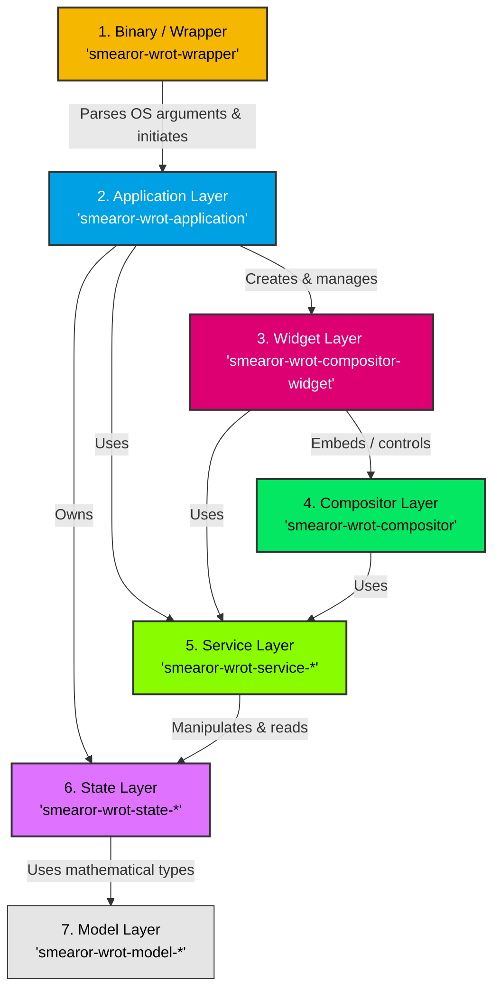

# Architecture Documentation (smearor-wrot)

This document describes the modular, layer-based architecture of `smearor-wrot`. The structure is designed to cleanly separate data, states, logic, user
interfaces, and system orchestration (Separation of Concerns).

---

## 7 Layers Overview

The application is structured into the following 7 layers, ordered from the lowest to the highest level of abstraction:

### 1. Model Layer (`model/`)

The Model Layer forms the foundation of the architecture. It contains exclusively pure, mathematical, and domain-specific data structures (Value Objects) that
do not contain any business logic or state mutations.

- *Examples:* `RgbColor`, `RgbaColor` (`model/color`), `Position`, `Size` (`model/geometry`).

### 2. State Layer (`state/`)

The State Layer is responsible for holding and managing application states. It contains exclusively the data structures for states (e.g., `AtomicBool`,
`RwLock`) and the corresponding `StateManager` instances that grant thread-safe access.

- *Special property:* Accesses the Model Layer. Contains no complex logic (such as rendering routines or IO workflows).
- *Crates:* `smearor-wrot-state-compositor`, `smearor-wrot-state-debug-overlay`, `smearor-wrot-state-keyboard`, `smearor-wrot-state-layer-shell`,
  `smearor-wrot-state-margin`, `smearor-wrot-state-window`.

### 3. Service Layer (`service/`)

The Service Layer contains the core business logic, workflows, and reusable routines. It manipulates and reads states via the State Layer.

- *Special property:* Has no user interface and does not assemble the compositor itself.
- *Crates:* `smearor-wrot-service-debug-overlay` (for calculations, overlay logic).

### 4. Compositor Layer (`compositor/`)

Integrates directly with the low-level Smithay library to realize the Wayland compositor. It orchestrates Wayland protocols, manages surfaces, sends configure
events, and processes inputs.

- *Special property:* Accesses the Service Layer to execute logic without implementing the logic itself.

### 5. Widget Layer (`widget/` or `smearor-wrot-compositor-widget`)

This layer is the home of all GTK 4 graphical components. It encapsulates the interaction with the desktop window system.

- *Special property:* Widgets access the Service Layer for logic and interactions. The `CompositorWidget` embeds the Compositor Layer to render Wayland surfaces
  onto GTK snapshots.
- *Components:* `CompositorWidget`, `PieMenuOverlayWidget`, `SettingsManager` (settings dialog).

### 6. Application Layer (`smearor-wrot-application/`)

The bridge of the entire application. It instantiates all components, connects the GTK window with the Wayland compositor, and initializes managers and sockets.

- *Dependencies:* Accesses the Widget Layer (to build the GUI), the Service Layer, and the State Layer.

### 7. Binary / Wrapper (`smearor-wrot-wrapper/`)

The actual entry point of the program (`main.rs`). It handles the interface to the operating system (CLI arguments, reading the TOML configuration file) and
merges both into states.

- *Special property:* Creates the `Application` instance based on the generated states and starts the GTK main loop.

---

## Color Palette for Diagrams (from DESIGN.md)

The colors used in this document and the READMEs follow the palette defined in `DESIGN.md`:

| Name                    | HEX Color Value | Usage in Diagram      |
|-------------------------|-----------------|-----------------------|
| **Malachite**           | `#04e762`       | Compositor Layer      |
| **Selective Yellow**    | `#f5b700`       | Binary / CLI & Config |
| **Celestial Blue**      | `#00a1e4`       | Application Layer     |
| **Mexican Pink**        | `#dc0073`       | Widget Layer / UI     |
| **Chartreuse**          | `#89fc00`       | Service Layer         |
| **Orchid/State-Purple** | `#df73ff`       | State Layer           |
