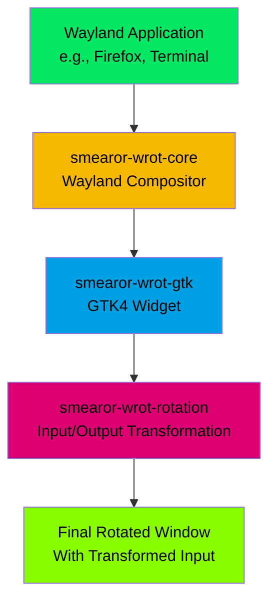

# Smearor Smart Desk Window Rotation (`smearor-wrot`)

A Wayland window rotation system designed for multi-user collaborative smart desks, enabling individual window rotation without rotating the entire screen.

## Overview

**smearor-wrot** (Application Display Layer Integration System for Adaptive Content) solves the orientation problem on large touchscreen smart desks where users sit
at different sides of the table. When users sit opposite each other, one person sees the content upside down. smearor-wrot allows individual window rotation so
multiple users can interact with applications oriented toward their position.

### Key Features

- **Individual Window Rotation**: Rotate any Wayland application window by any angle
- **Input Transformation**: Mouse and touch input coordinates are automatically transformed according to window rotation
- **Cross-Desktop Compatibility**: Works with Hyprland, Sway, GNOME, and other Wayland compositors
- **High Performance**: Maintains 60 FPS rendering with hardware acceleration support
- **Touch Support**: Full touch input support for smart desk surfaces
- **Multi-Window**: Support for multiple rotated windows simultaneously

### Architecture Overview



## Quick Start

### Prerequisites

- Rust 1.87+
- GTK4 development libraries
- Wayland development libraries
- Linux with Wayland compositor (Hyprland, Sway, GNOME, etc.)

### Installation

```bash
# Install dependencies (Ubuntu/Debian)
sudo apt update
sudo apt install build-essential pkg-config libgtk-4-dev libwayland-dev

# Clone the repository
git clone https://github.com/smearor/smearor-wrot.git
cd smearor-wrot

# Build the project
cargo build --release

# Install (optional)
cargo install --path .
```

### Basic Usage

```bash
# Rotate an application by 180 degrees
smearor-wrot --angle 180 -- firefox

# Launch a terminal rotated 90 degrees clockwise
smearor-wrot --angle 90 -- gnome-terminal

# Custom window size with rotation
smearor-wrot --angle 270 --width 800 --height 600 -- kate

# Fullscreen rotated application
smearor-wrot --angle 180 --fullscreen -- vlc
```

### Command Line Options

| Option              | Description                    |
|---------------------|--------------------------------|
| `--angle <DEGREES>` | Rotation angle (0-360 degrees) |
| `--width <PIXELS>`  | Window width                   |
| `--height <PIXELS>` | Window height                  |
| `--fullscreen`      | Launch in fullscreen mode      |
| `--maximized`       | Launch maximized               |
| `--no-decoration`   | Remove window decorations      |
| `--socket <NAME>`   | Custom Wayland socket name     |
| `--help`            | Show all available options     |

## Security

See [SECURITY.md](SECURITY.md) for our security policy.

## License

This project is licensed under the MIT License - see the [LICENSE.md](LICENSE.md) file for details.

## Changelog

See [CHANGELOG.md](CHANGELOG.md) for version history and changes.

## Acknowledgments

- Idea and inspiration from [Casilda](https://gitlab.gnome.org/jpu/casilda)
- Built with [Smithay](https://smithay.github.io/smithay/) Wayland compositor framework
- Uses [GTK4](https://gtk-rs.org/gtk4-rs/stable/latest/docs/gtk4/) for GUI widgets
- Inspired by the need for collaborative smart desk environments

---

> smearor-wrot - Making collaborative smart desks truly collaborative.
