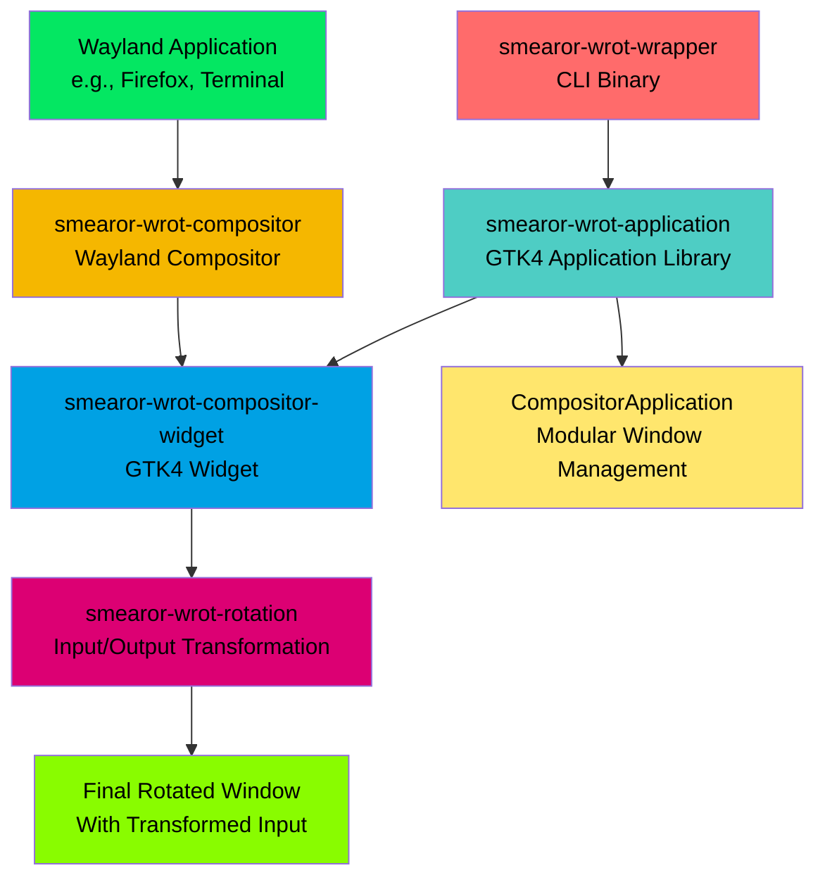

# Smearor Smart Desk Window Rotation (`smearor-wrot`)

A Wayland window rotation system designed for multi-user collaborative smart desks, enabling individual window rotation without rotating the entire screen.

## Overview

**smearor-wrot** solves the orientation problem on large touchscreen smart desks where users
sit at different sides of the table. When users sit opposite each other, one person sees the
content upside down. smearor-wrot allows individual window rotation so multiple users can
interact with applications oriented toward their position.

### Key Features

- **Individual Window Rotation**: Rotate any Wayland application window by any angle
- **Input Transformation**: Mouse and touch input coordinates are automatically transformed according to window rotation
- **Cross-Desktop Compatibility**: Works with Hyprland, Sway, GNOME, and other Wayland compositors
- **High Performance**: Maintains 60 FPS rendering with hardware acceleration support
- **Touch Support**: Full touch input support for smart desk surfaces
- **Multi-Window**: Support for multiple rotated windows simultaneously

### Architecture Overview



#### Crate Structure

The project is organized into two main crates:

- **`smearor-wrot-wrapper`** (Binary)
  - Thin CLI entry point for command-line argument parsing
  - Configuration file loading and merging
  - Delegates to `smearor-wrot-application` for all GUI logic

- **`smearor-wrot-application`** (Library)
  - Modular `CompositorApplication` for GTK4 window lifecycle management
  - Integration of compositor widget, rotation widget, and pie menu
  - Settings dialog, screenshot functionality, and clipboard synchronization
  - Clean separation of concerns with builder pattern

#### Supporting Crates

- **`smearor-wrot-compositor`**: Smithay-based Wayland compositor core
- **`smearor-wrot-compositor-widget`**: GTK4 widget for compositor rendering
- **`smearor-wrot-rotation`**: Input/output transformation for window rotation
- **`smearor-wrot-pie-menu`**: Pie menu overlay for quick actions
- **`smearor-wrot-model`**: Shared data models and types

## Quick Start

### Prerequisites

- Rust 1.87+
- GTK4 development libraries
- Wayland development libraries
- Linux with Wayland compositor (Hyprland, Sway, GNOME, etc.)

### Installation

```bash
# Install dependencies (Ubuntu/Debian)
sudo apt update
sudo apt install build-essential pkg-config libgtk-4-dev libwayland-dev

# Clone the repository
git clone https://github.com/smearor/smearor-wrot.git
cd smearor-wrot

# Build the project
cargo build --release

# Install (optional)
cargo install --path .
```

### Basic Usage

```bash
# Rotate an application by 180 degrees
smearor-wrot --rotation 180 -- gnome-chess

# Launch a terminal rotated 90 degrees clockwise
smearor-wrot --rotation 90 -- gnome-terminal

# Custom window size with rotation
smearor-wrot --rotation 270 --width 800 --height 600 -- gnome-2048

# Fullscreen rotated application
smearor-wrot --rotation 180 --fullscreen -- gnome-calculator
```

### Command Line Options

| Option                                                        | Description                                                                                                    |
|---------------------------------------------------------------|----------------------------------------------------------------------------------------------------------------|
| `-R, --disable-rotation`                                      | Disable the rotation widget even if a rotation value is provided                                               |
| `-r, --rotation <ROTATION>`                                   | Rotation angle in degrees [default: 0]                                                                         |
| `-W, --width <WIDTH>`                                         | Initial width of the application window [default: 1200]                                                        |
| `-H, --height <HEIGHT>`                                       | Initial height of the application window [default: 1200]                                                       |
| `-d, --decorated`                                             | Whether the window should have client-side decorations                                                         |
| `--resizable`                                                 | Whether the window should be resizable                                                                         |
| `-x, --position-x <POSITION_X>`                               | Initial x position of the window                                                                               |
| `-y, --position-y <POSITION_Y>`                               | Initial y position of the window                                                                               |
| `-w, --min-width <MIN_WIDTH>`                                 | Minimum width of the window                                                                                    |
| `--min-height <MIN_HEIGHT>`                                   | Minimum height of the window                                                                                   |
| `--max-width <MAX_WIDTH>`                                     | Maximum width of the window                                                                                    |
| `--max-height <MAX_HEIGHT>`                                   | Maximum height of the window                                                                                   |
| `--aspect-ratio <ASPECT_RATIO>`                               | Aspect ratio as width/height (e.g., 1.777 for 16:9)                                                            |
| `-f, --fullscreen`                                            | Start in fullscreen mode                                                                                       |
| `-m, --maximized`                                             | Start in maximized mode                                                                                        |
| `-b, --double-buffer`                                         | Enable double buffering (default: true)                                                                        |
| `--disable-dma-buf`                                           | Disable DMA-BUF hardware acceleration (default: false)                                                         |
| `-i, --id <ID>`                                               | Application ID                                                                                                 |
| `-t, --title <TITLE>`                                         | Title of the application window                                                                                |
| `--layer <LAYER>`                                             | Specify the layer for the layer shell protocol (e.g., Background, Top)                                         |
| `-n, --namespace <NAMESPACE>`                                 | Namespace for the layer shell, used by compositors for rules                                                   |
| `-s, --shell`                                                 | Runs the command in a shell                                                                                    |
| `-S, --socket <SOCKET>`                                       | Path to the Wayland Unix socket to be created (relative name in XDG_RUNTIME_DIR)                               |
| `-c, --config <CONFIG>`                                       | Path to the configuration file (TOML format)                                                                   |
| `--wayland-debug`                                             | Enable WAYLAND_DEBUG=1 for child process                                                                       |
| `--gsk-renderer-gl`                                           | Enable GSK_RENDERER=gl for child process                                                                       |
| `--disable-client-decorations`                                | Disable client-side decorations for Wayland clients in the compositor                                          |
| `--margin <MARGIN>`                                           | Margin in pixels for window rendering (shortcut for all margins)                                               |
| `--margin-left <MARGIN_LEFT>`                                 | Left margin in pixels for window rendering [default: 0]                                                        |
| `--margin-right <MARGIN_RIGHT>`                               | Right margin in pixels for window rendering [default: 0]                                                       |
| `--margin-top <MARGIN_TOP>`                                   | Top margin in pixels for window rendering [default: 0]                                                         |
| `--margin-bottom <MARGIN_BOTTOM>`                             | Bottom margin in pixels for window rendering [default: 0]                                                      |
| `--opacity <OPACITY>`                                         | Opacity of the compositor (0.0 = fully transparent, 1.0 = fully opaque) [default: 1]                           |
| `--background-color <BACKGROUND_COLOR>`                       | Background color in hex format (e.g., #FF0000 for red)                                                         |
| `--subsurface-background-color <SUBSURFACE_BACKGROUND_COLOR>` | Subsurface background color in hex format (e.g., #FF0000 for red on subsurfaces)                               |
| `--color-mask <COLOR_MASK>`                                   | Color mask in hex format for chroma-keying (e.g., #808080 to make gray transparent)                            |
| `--auto-color-mask`                                           | Enable automatic background color detection for color mask                                                     |
| `--subsurface-color-mask <SUBSURFACE_COLOR_MASK>`             | Subsurface color mask in hex format for chroma-keying (e.g., #FFFFFF to make white transparent on subsurfaces) |
| `--auto-subsurface-color-mask`                                | Enable automatic background color detection for subsurface color mask                                          |
| `--color-mask-tolerance <COLOR_MASK_TOLERANCE>`               | Tolerance for color mask (0.0-1.0, default: 0.1) [default: 0.1]                                                |
| `--color-mask-shader`                                         | Enable shader-based color masking for better performance (default: false)                                      |
| `--window-opacity <WINDOW_OPACITY>`                           | Window opacity for the compositor window (0.0 = fully transparent, 1.0 = fully opaque) [default: 1]            |
| `--max-fps <MAX_FPS>`                                         | Maximum frames per second (default: 60) [default: 60]                                                          |
| `--dialog-margin <DIALOG_MARGIN>`                             | Dialog margin in pixels for dialog positioning (default: 0) [default: 0]                                       |
| `--animation-speed <ANIMATION_SPEED>`                         | Animation speed in milliseconds for rotation overshoot animation (default: 500) [default: 500]                 |
| `--animation-overshoot <ANIMATION_OVERSHOOT>`                 | Animation overshoot amount for rotation gesture (default: 1.7) [default: 1.7]                                  |
| `--disable-animations`                                        | Disable all animations                                                                                         |
| `--debug-touch`                                               | Enable visual debugging of touch points (red rectangle for GTK coordinates, green border for app coordinates)  |
| `--debug-pointer`                                             | Enable visual debugging of pointer (blue rectangle for GTK coordinates, magenta border for app coordinates)    |
| `--override-wayland-display <OVERRIDE_WAYLAND_DISPLAY>`       | Override the WAYLAND_DISPLAY environment variable for the GTK4 application                                     |
| `-h, --help`                                                  | Print help                                                                                                     |
| `-V, --version`                                               | Print version                                                                                                  |

## Security

See [SECURITY.md](SECURITY.md) for our security policy.

## License

This project is licensed under the MIT License - see the [LICENSE.md](LICENSE.md) file for details.

## Changelog

See [CHANGELOG.md](CHANGELOG.md) for version history and changes.

## Acknowledgments

- Idea and inspiration from [Casilda](https://gitlab.gnome.org/jpu/casilda)
- Built with [Smithay](https://smithay.github.io/smithay/) Wayland compositor framework
- Uses [GTK4](https://gtk-rs.org/gtk4-rs/stable/latest/docs/gtk4/) for GUI widgets
- Inspired by the need for collaborative smart desk environments

---

> smearor-wrot - Making collaborative smart desks truly collaborative.
