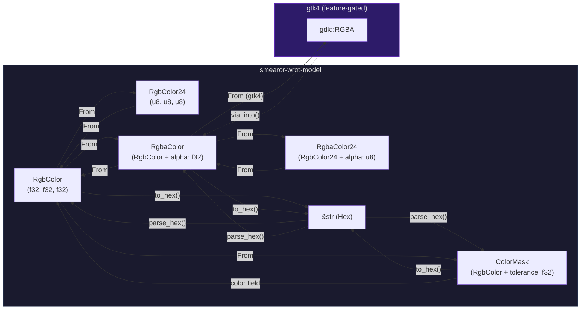
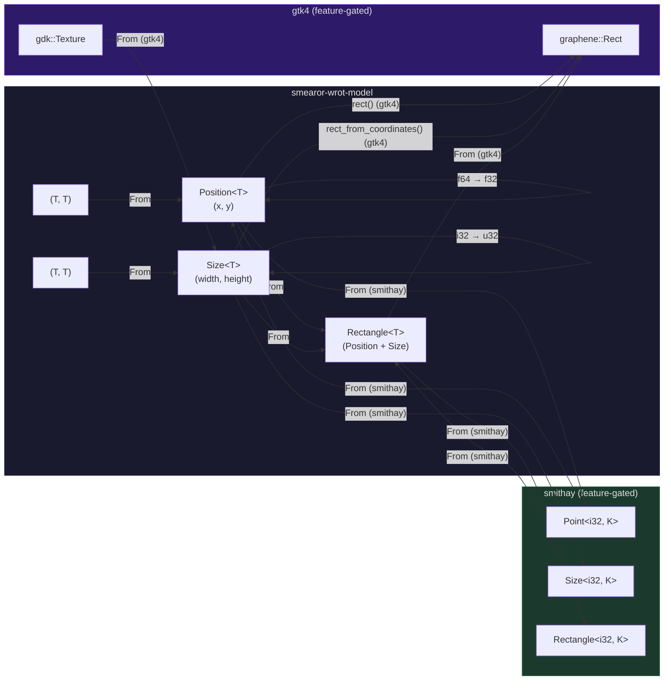
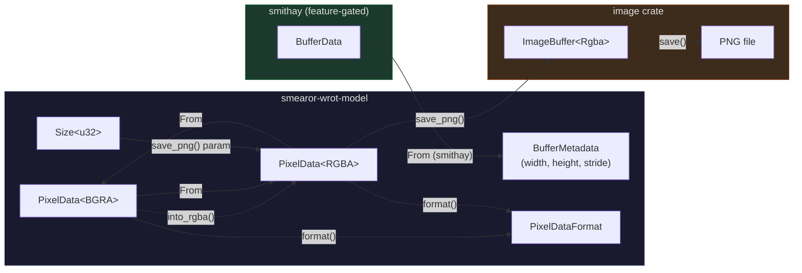
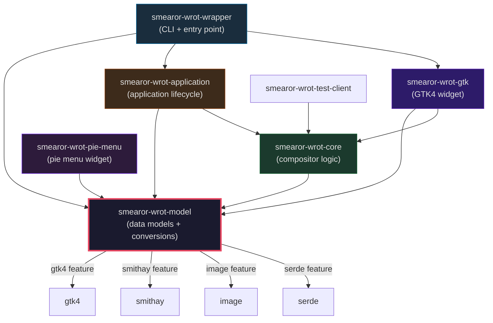
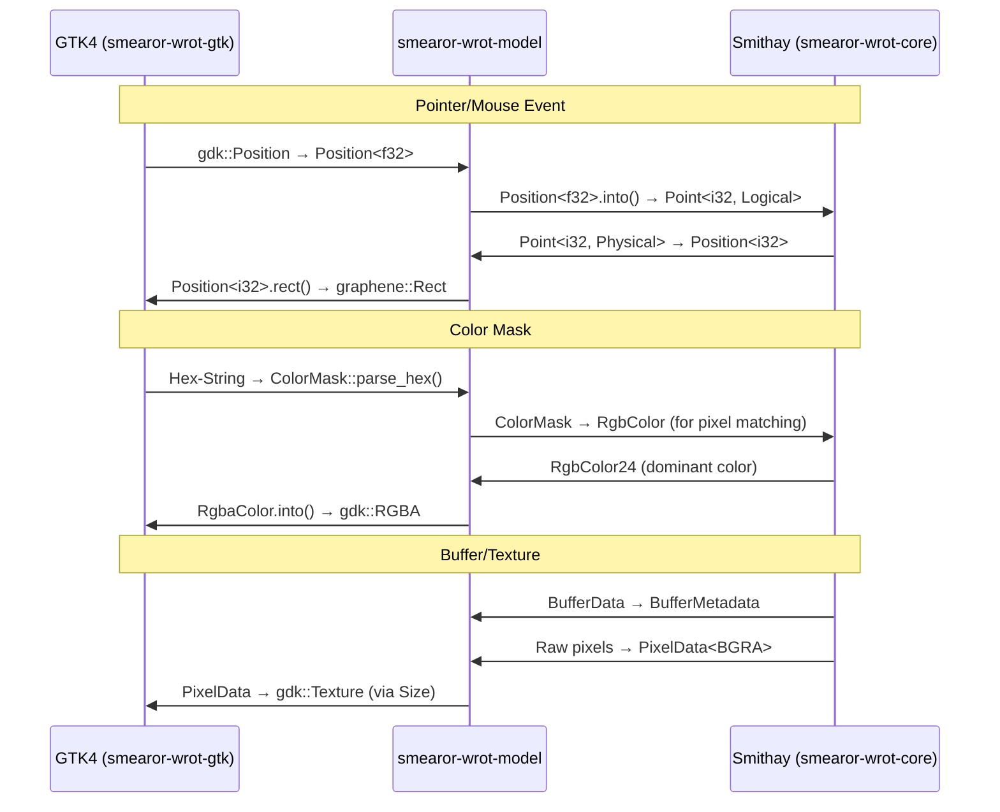

# Refactoring: Extract and Unify Data Models

## Goal

Extract and unify all data models from individual crates into the `smearor-wrot-model` crate. The model crate becomes the central hub for cross-domain data types that bridge the GTK and Smithay worlds.

## Principles

- **One struct per concept**: Each data type exists exactly once in the model crate.
- **Framework independence**: The model crate contains no GTK or Smithay dependencies in its core structs. Conversions are done via `From`/`Into` traits behind feature flags (`gtk4`, `smithay`).
- **Feature-gated conversions**: GTK and Smithay `From` implementations are gated behind `#[cfg(feature = "...")]`, as already established.
- **One file per struct**: Each struct/enum gets its own file according to AGENTS.md.
- **Module structure**: `mod.rs` per module with `pub use` re-exports for a clean API.
- **Documentation**: All public types and fields receive Rustdoc comments (`///`).
- **No abbreviations**: Descriptive names, no abbreviations.
- **Trait implementations over free functions**: Encapsulate parsing/serialization/conversion logic via standard traits (`FromStr`, `Display`, `From`, `Into`).

## Inventory

### Already present in `smearor-wrot-model`

| Module | Types | GTK/Smithay Conversion |
|--------|-------|------------------------|
| `color` | `RgbColor`, `RgbColor24`, `RgbaColor`, `RgbaColor24`, `ColorFrequency`, `ColorFrequencyMap`, `ToHex`, `ParseHexError` | `From<RgbaColor> for gdk::RGBA` |
| `geometry` | `Position<T>`, `Size<T>` | `From<Position> for smithay::utils::Point`, `From<Size> for smithay::utils::Size`, `rect()`/`rect_from_coordinates()` for `gtk4::graphene::Rect` |
| `margin` | `Margins` | - |
| `pointer` | `PointerPosition<T>` | `render_snapshot()` with `gtk4::Snapshot` |
| `socket` | `Socket` | - |

### Data models to extract

#### 1. ColorMask (Duplicate — highest priority)

- **Core**: `smearor-wrot-core/src/color_mask/mask.rs` — uses `RgbColor` + `tolerance: f32`, implements `ToHex`, `Display`
- **GTK**: `smearor-wrot-gtk/src/config.rs:70-76` — raw `f32` fields (red/green/blue), does **not** use `RgbColor`

**Action**: Move the Core version as canonical to `smearor-wrot-model/src/color/mask.rs`. Remove GTK's raw-f32 version. Move `ToHex` implementation into the model. GTK uses `ColorMask` from model going forward. Feature-gated `From<ColorMask> for (f32, f32, f32)` if needed.

#### 2. Rectangle (new)

Core uses `smithay::utils::Rectangle` directly (`damage/output.rs`, `handlers/compositor.rs`, `windows/configuration.rs`, `buffer/tracking.rs`). GTK uses `gtk4::graphene::Rect`.

**Action**: New `Rectangle<T>` in `smearor-wrot-model/src/geometry/rectangle.rs` composed from `Position<T>` + `Size<T>`. `From` traits to `smithay::utils::Rectangle` and `gtk4::graphene::Rect`.

**Coordinate precision & explicit conversion methods**:

GTK uses float-based coordinates (`graphene::Rect`), while Smithay distinguishes strongly between logical and physical integer or float points. In addition to the standard `From` traits, explicit conversion methods for `Rectangle<f32>` to `Rectangle<i32>` must be provided to avoid rounding errors when converting compositor buffers to display surfaces:

- `to_i32_round()` — Rounds to the nearest integer (standard for display coordinates)
- `to_i32_floor()` — Rounds down (for clipping/bounding boxes, to not exceed any pixels)
- `to_i32_ceil()` — Rounds up (for damage tracking, to capture all affected pixels)
- `to_f32()` — Lossless conversion from `Rectangle<i32>` to `Rectangle<f32>`

These methods are also needed for `Position<T>` and `Size<T>` and should be added there as well. The existing `From` impls (`Position<i32>` → `Position<f32>`, etc.) remain in place; the new methods provide control over rounding behavior.

#### 3. PixelData / PixelDataFormat

- **Core**: `smearor-wrot-core/src/texture/pixel_data.rs` — `PixelData<T>`, `BGRA`, `RGBA` marker structs, `PixelDataFormat` enum, `PixelDataSaveError`

**Action**: Move to `smearor-wrot-model/src/texture/pixel_data.rs`. Pure data structure without framework dependency (only `image` crate). `ColorMask` operations (`replace_color`, `apply_color_mask`) remain in Core, as they contain `ColorMask` logic.

**Performance during conversions**:

Buffer data often contains large byte arrays (`Vec<u8>`). These conversions run every frame during compositor rendering. It must be ensured that unnecessary heap allocations are avoided:

- `into_rgba()` already works in-place (`mut self`) and swaps bytes directly in the existing `Vec<u8>` — this must be preserved.
- `From<&PixelData<BGRA>> for PixelData<RGBA>` and `From<&PixelData<RGBA>> for PixelData<BGRA>` necessarily require a new allocation (source and target are different objects). These should be avoided where possible, using `into_rgba()` (in-place) instead.
- For future conversions, an in-place variant (`fn convert_in_place(&mut self)`) should be preferred, provided the target format has the same buffer size (BGRA ↔ RGBA: 4 bytes per pixel, same size).
- For conversions with different buffer sizes (e.g. RGB → RGBA), a new allocation is unavoidable; `Vec::with_capacity` should be used to avoid reallocations.
- In addition to the in-place methods, it must be possible to create a copy (`fn to_rgba(&self) -> PixelData<RGBA>`), so that the original data is preserved. This is important for caching scenarios (e.g. `TextureCacheEntry`), where both the original and the converted variant are needed.

#### 4. BufferMetadata

- **Core**: `smearor-wrot-core/src/buffer/metadata.rs` — `width: i32`, `height: i32`, `stride: i32`

**Action**: Move to `smearor-wrot-model/src/buffer/metadata.rs`. `From<&BufferData>` (Smithay) behind `smithay` feature gate. Optional: use `Size<i32>` for width/height.

#### 5. CompositorMessage

- **Core**: `smearor-wrot-core/src/message/compositor_message.rs` — pure enum without framework dependency

**Action**: Move to `smearor-wrot-model/src/message/compositor_message.rs`.

**IPC capability & serde serialization**:

When `CompositorMessage` is transmitted over sockets between Wrapper/Application and the Compositor, it must be ensured that `serde` can also be applied to `CompositorMessage`. When the `serde` feature is enabled, `CompositorMessage` should implement `Serialize` and `Deserialize`. This enables transmission via `bincode` (binary, compact) or `serde_json` (human-readable, for debugging). The `serde` derives are gated behind `#[cfg(feature = "serde")]`, so the model crate without the `serde` feature still carries no serialization dependency.

#### 6. DebugOverlayConfig

- **GTK**: `smearor-wrot-gtk/src/widget/debug_overlay/config.rs` — two `bool` flags

**Action**: Move to `smearor-wrot-model/src/config/debug_overlay.rs`.

#### 7. KeyboardLayout

- **Application**: `smearor-wrot-application/src/keyboard/layout.rs` — `layout: String`, `variant: Option<String>`

**Action**: Move to `smearor-wrot-model/src/keyboard/layout.rs`.

#### 8. MenuItem

- **Pie-Menu**: `smearor-wrot-pie-menu/src/menu/item.rs` — stores colors as hex strings (`label_color: String`, `color: String`)

**Action**: Move to `smearor-wrot-model/src/menu/item.rs`. Colors as `RgbaColor` instead of hex strings. `FromStr`/`Display` for hex compatibility if needed.

**Builder ergonomics**:

To keep menu item creation convenient, the setter functions in the `TypedBuilder` should accept `impl Into<RgbaColor>`. This allows callers to pass instances of `RgbaColor` as well as `RgbColor` or hex strings (`&str`/`String`) directly, without having to convert manually. This requires `From<&str> for RgbaColor` (hex parsing) and `From<RgbColor> for RgbaColor` (default alpha = 1.0). Example:

```rust
MenuItem::builder()
    .id("close")
    .label("Close")
    .label_color("#FFFFFFFF")  // &str → RgbaColor via From
    .color(RgbColor::new(0.5, 0.5, 0.5))  // RgbColor → RgbaColor via From
    .icon_name("window-close")
    .angle(180.0)
    .event("close")
    .build()
```

#### 9. Config structures (overlap)

- **GTK**: `CompositorWidgetConfig` in `smearor-wrot-gtk/src/config.rs`
- **Wrapper**: `WindowConfig`, `CompositorConfig` in `smearor-wrot-wrapper/src/config.rs`

Overlapping fields: opacity, margins, color_mask, fullscreen, width/height, etc.

**Action**: Unified config hierarchy in `smearor-wrot-model/src/config/`. `serde` as optional feature. GTK and Wrapper derive their specific configs from the model config structs or convert via `From`.

**Serde robustness & backward compatibility**:

When implementing `serde` for config structures, it must be ensured that newly added config fields do not break backward compatibility of existing configuration files at the user level. The following measures should be taken:

- **`#[serde(default)]` at struct level**: Each config struct gets `#[serde(default)]`, so missing fields in the TOML file are filled with `Default` values.
- **`#[serde(default)]` at field level**: For fields whose default value does not correspond to the `Default` trait, use `#[serde(default = "fn_name")]`.
- **`Option<T>` for optional fields**: Fields that can explicitly be unset (e.g. `max_width: Option<i32>`) remain as `Option<T>` and are treated as `None` with the application default.
- **`#[serde(rename_all = "snake_case")]`**: For consistent TOML field names following Rust conventions.
- **Version field**: Optionally, a `#[serde(default)] version: Option<String>` field can be added to enable future migration logic.

## Target structure of the model crate

```
smearor-wrot-model/
├── Cargo.toml
└── src/
    ├── lib.rs                          # mod declarations + pub use re-exports
    ├── color/
    │   ├── mod.rs                      # pub use re-exports
    │   ├── hex.rs                      # ToHex trait, ParseHexError
    │   ├── rgb.rs                      # RgbColor, RgbColor24
    │   ├── rgba.rs                     # RgbaColor, RgbaColor24
    │   ├── mask.rs                     # ColorMask (NEW from core)
    │   └── frequency.rs                # ColorFrequency, ColorFrequencyMap
    ├── geometry/
    │   ├── mod.rs                      # pub use re-exports
    │   ├── position.rs                 # Position<T>
    │   ├── size.rs                     # Size<T>
    │   └── rectangle.rs                # Rectangle<T> (NEW)
    ├── buffer/
    │   ├── mod.rs                      # pub use re-exports
    │   └── metadata.rs                 # BufferMetadata (NEW from core)
    ├── texture/
    │   ├── mod.rs                      # pub use re-exports
    │   └── pixel_data.rs               # PixelData<T>, BGRA, RGBA, PixelDataFormat (NEW from core)
    ├── message/
    │   ├── mod.rs                      # pub use re-exports
    │   └── compositor_message.rs       # CompositorMessage (NEW from core)
    ├── config/
    │   ├── mod.rs                      # pub use re-exports
    │   └── debug_overlay.rs            # DebugOverlayConfig (NEW from gtk)
    ├── keyboard/
    │   ├── mod.rs                      # pub use re-exports
    │   └── layout.rs                   # KeyboardLayout (NEW from application)
    ├── menu/
    │   ├── mod.rs                      # pub use re-exports
    │   └── item.rs                     # MenuItem (NEW from pie-menu)
    ├── margin.rs                       # Margins
    ├── pointer.rs                      # PointerPosition<T>
    └── socket.rs                       # Socket
```

## Phase plan

### Phase 1: Foundation & bugfix

- [ ] `PointerPosition` in model: move unconditional `gtk4::Snapshot`/`gtk4::prelude::SnapshotExt` imports behind `#[cfg(feature = "gtk4")]`
- [ ] New `Rectangle<T>` in `smearor-wrot-model/src/geometry/rectangle.rs`:
  - Composed from `Position<T>` + `Size<T>`
  - `From<Rectangle> for smithay::utils::Rectangle` (feature-gated)
  - `From<Rectangle> for gtk4::graphene::Rect` (feature-gated)
  - `From<smithay::utils::Rectangle> for Rectangle` (feature-gated)
  - Arithmetic traits (`Add`, `Sub`, etc.) analogous to `Position`/`Size`
- [ ] Verify `cargo build` + `cargo test`
- [ ] Feature-gate verification: `cargo hack check --workspace --feature-powerset` (ensures all feature combinations build, e.g. only `gtk4` without `smithay` or no features at all)

### Phase 2: Unify ColorMask

- [ ] Move `ColorMask` to `smearor-wrot-model/src/color/mask.rs`
  - Move `ToHex` implementation
  - Move `Display` implementation
  - Add `From<ColorMask> for RgbColor`
- [ ] Update `smearor-wrot-core`: import `ColorMask` from model, remove local module
- [ ] Update `smearor-wrot-gtk`: remove raw-f32 `ColorMask` from `config.rs`, use `ColorMask` from model
- [ ] Adapt all usage sites in GTK (`.red`/`.green`/`.blue` → `.color.red`/`.color.green`/`.color.blue`)
- [ ] Verify `cargo build` + `cargo test`

### Phase 3: Extract domain models from Core

- [ ] `PixelData<T>`, `BGRA`, `RGBA`, `PixelDataFormat`, `PixelDataSaveError` → `smearor-wrot-model/src/texture/pixel_data.rs`
  - Keep `ColorMask` operations (`replace_color`, `apply_color_mask`) in Core (as extension traits or methods importing `ColorMask` from model)
- [ ] `BufferMetadata` → `smearor-wrot-model/src/buffer/metadata.rs`
  - `From<&BufferData>` behind `smithay` feature gate
- [ ] `CompositorMessage` → `smearor-wrot-model/src/message/compositor_message.rs`
- [ ] Update Core dependencies: add `smearor-wrot-model` as dependency, remove local modules
- [ ] Verify `cargo build` + `cargo test`

### Phase 4: Extract models from GTK/Application/Pie-Menu

- [ ] `DebugOverlayConfig` → `smearor-wrot-model/src/config/debug_overlay.rs`
- [ ] `KeyboardLayout` → `smearor-wrot-model/src/keyboard/layout.rs`
- [ ] `MenuItem` → `smearor-wrot-model/src/menu/item.rs`
  - `label_color` and `color` as `RgbaColor` instead of `String`
  - `FromStr`/`Display` for hex compatibility
  - Adapt Pie-Menu: builder setters accept `RgbaColor` or `&str` (via `Into`)
- [ ] Verify `cargo build` + `cargo test`

### Phase 5: Unify config structures

- [ ] Define shared config structs in `smearor-wrot-model/src/config/`
  - `serde` as optional feature in the model crate
  - `WindowConfig`, `CompositorConfig` as canonical structs
- [ ] Derive GTK `CompositorWidgetConfig` from model config or convert via `From`
- [ ] Bind wrapper config to model config
- [ ] Verify `cargo build` + `cargo test`

### Phase 6: Cleanup & verification

- [ ] All duplicates removed
- [ ] All crates use model as central data source
- [ ] `cargo fmt` across the entire workspace
- [ ] `cargo clippy` across the entire workspace
- [ ] `cargo build` + `cargo test` across the entire workspace
- [ ] `cargo audit` for security check
- [ ] Feature-gate verification: `cargo hack check --workspace --feature-powerset` (all feature combinations of the model crate)
- [ ] Feature-gate test verification: `cargo hack test --workspace --feature-powerset` (tests for all feature combinations)

## CI integration

To detect errors in feature-gate conditions (`#[cfg(feature = "...")]`) early, feature-powerset verification should be integrated into CI. On Ubuntu/Linux, this can be automated using `cargo-hack`:

```bash
cargo hack check --workspace --feature-powerset
cargo hack test --workspace --feature-powerset
```

This ensures that the crate builds and tests correctly even when only `gtk4` without `smithay`, only `smithay` without `gtk4`, or no features at all are enabled. `cargo-hack` must be installed in the CI environment (`cargo install cargo-hack`).

## Testing

Comprehensive tests will be created for the model crate. The following tests are required:

### Unit tests (inline in respective files)

- **Color tests**: `RgbColor`/`RgbColor24`/`RgbaColor`/`RgbaColor24`
  - Conversion between f32 and u8 representations
  - Hex parsing (`parse_hex`) for valid/invalid inputs
  - `ToHex` roundtrip: parse → to_hex → parse == original
  - `clamp()` behavior
  - `transparent()` default
  - `ColorMask`: tolerance clamping, `ToHex`, `Display`, `with_default_tolerance`
- **Geometry tests**: `Position<T>`, `Size<T>`, `Rectangle<T>`
  - Arithmetic operations (`Add`, `Sub`, `AddAssign`, `SubAssign`)
  - Type conversions (`Position<i32>` → `Position<f32>`, etc.)
  - `Default` values
  - `Display` formatting
  - `Rectangle` construction from `Position` + `Size`
  - Explicit rounding methods (`to_i32_round`, `to_i32_floor`, `to_i32_ceil`, `to_f32`)
  - Feature-gated: `From` traits to `smithay::utils::Point`/`Size`/`Rectangle` and `gtk4::graphene::Rect`
- **Buffer tests**: `BufferMetadata`
  - Construction, `Display`, `From<&BufferData>` (feature-gated)
- **Texture tests**: `PixelData<BGRA>`, `PixelData<RGBA>`
  - `is_zero()` for empty and filled data
  - `get_frequency_map()` with various quantization steps
  - `get_dominant_color()`
  - Conversion `BGRA` ↔ `RGBA` (in-place and copy)
  - `save_png()` (feature-gated)
- **Message tests**: `CompositorMessage`
  - Variant coverage, `Clone`/`Debug`
  - Serde serialization/deserialization (feature-gated)
- **Config tests**: `DebugOverlayConfig`
  - Default values
- **Keyboard tests**: `KeyboardLayout`
  - Construction, `Display`, `Clone`
- **Menu tests**: `MenuItem`
  - Builder construction
  - `radius()` default
  - `Hash`/`Eq`/`PartialEq` based on `id`
  - Colors as `RgbaColor` instead of strings
  - Builder accepts `&str` and `RgbColor` via `Into<RgbaColor>`
- **Margin tests**: `Margins`
  - Construction, `Display`, `Default`
- **Pointer tests**: `PointerPosition<T>`
  - Construction, `new_pointer`/`new_touch` (feature-gated)
  - `gtk_rect`/`app_rect` (feature-gated)
- **Socket tests**: `Socket`
  - `From<PathBuf>`, `Deref`, `AsRef`, `Display`

### Test conventions

- Tests inline in respective files (`#[cfg(test)] mod tests`)
- Test names describe behavior (`test_rgba_color_clamp_within_bounds`)
- Test both success and error cases
- Feature-gated tests with `#[cfg(feature = "...")]`
- Cover edge cases (empty strings, zero values, max values, overflows)

## Documentation

Additionally, documentation `docs/MODEL.md` will be created, covering the following content:

- **Overview**: Purpose and architecture of the model crate
- **Module structure**: Description of each module and its types
- **Type reference**: For each public type:
  - Purpose and semantics
  - Fields with description
  - Conversion traits (GTK/Smithay)
  - Feature gates
- **Conversion matrix**: Table of all `From`/`Into` relationships between model types and framework types
- **Feature flags**: Documentation of the `gtk4`, `smithay`, `image`, and `serde` feature flags
- **Examples**: Typical usage patterns
- **Testing**: Overview of test coverage

## Conversion diagrams

### Color conversions



### Geometry conversions



### Buffer & texture conversions



### Crate dependencies (target state)



### Data flow: GTK ↔ Smithay via model



## Model crate dependencies

```toml
[dependencies]
dashmap = { workspace = true }
gtk4 = { workspace = true, optional = true }
image = { workspace = true, optional = true }
serde = { workspace = true, optional = true }
smithay = { workspace = true, optional = true }
thiserror = { workspace = true }
typed-builder = { workspace = true }

[features]
default = []
gtk4 = ["dep:gtk4"]
smithay = ["dep:smithay"]
image = ["dep:image"]
serde = ["dep:serde"]
```
