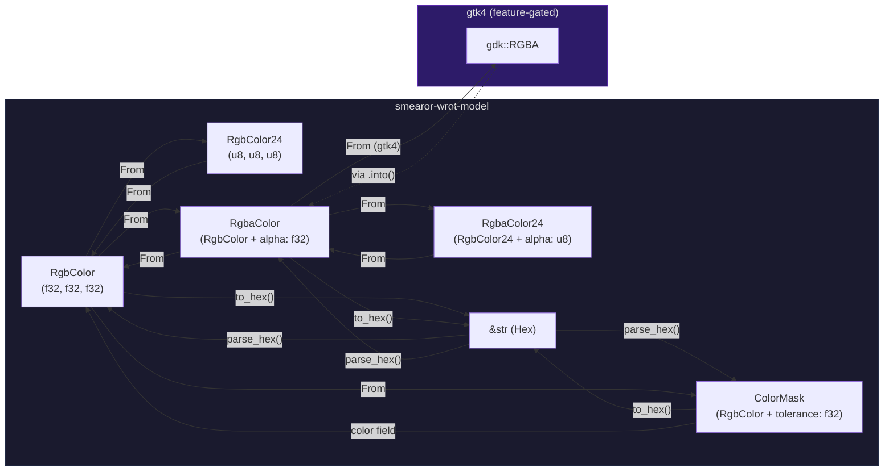
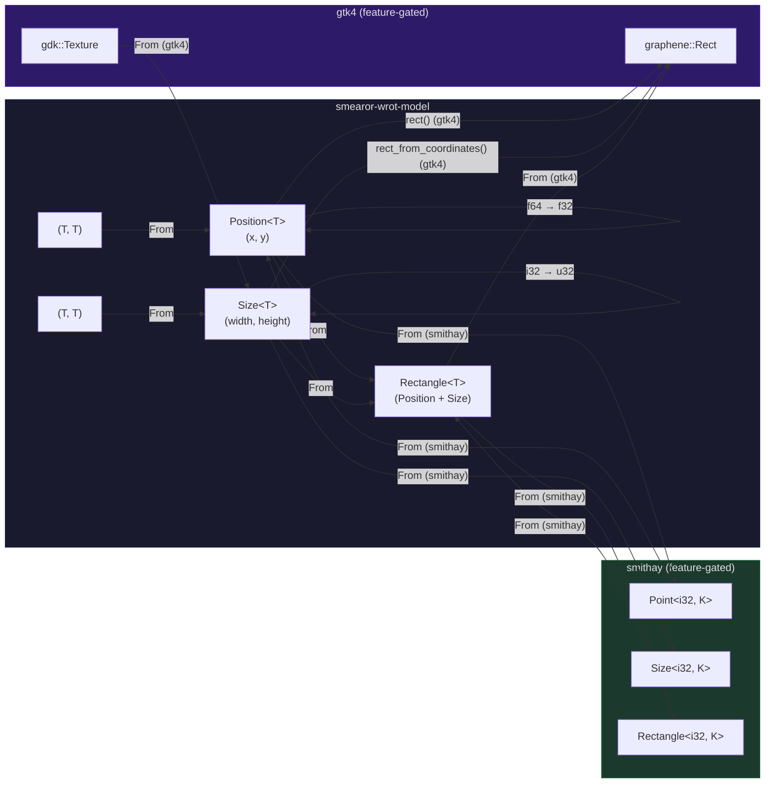
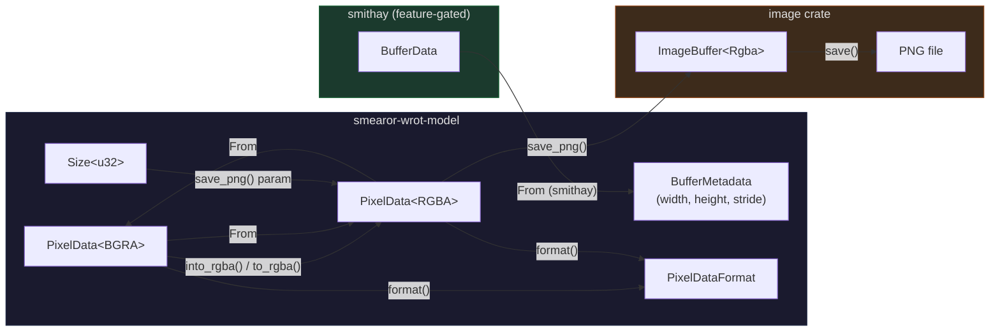
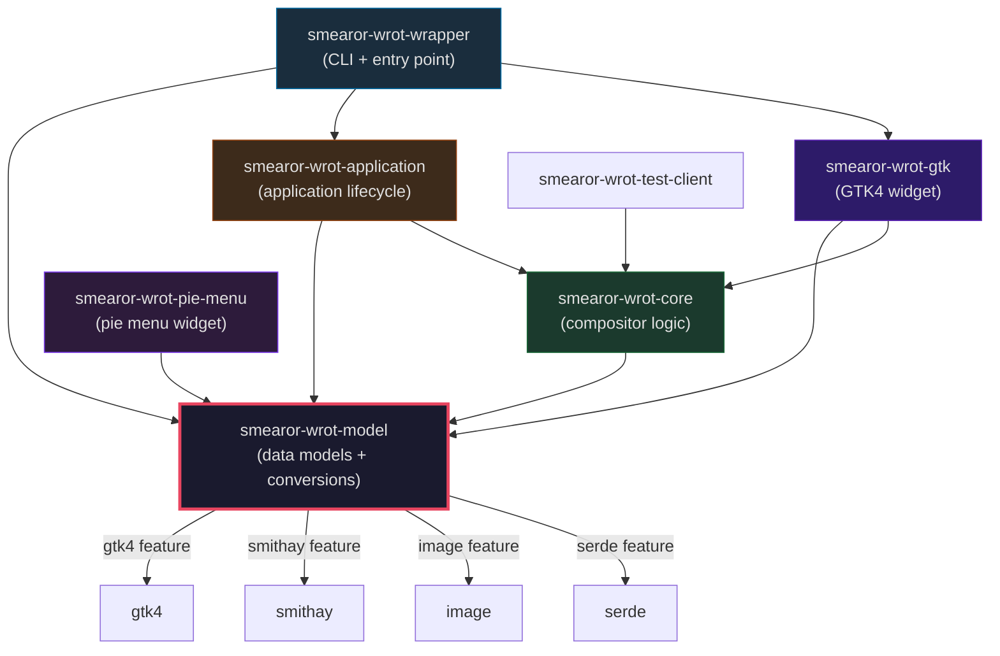
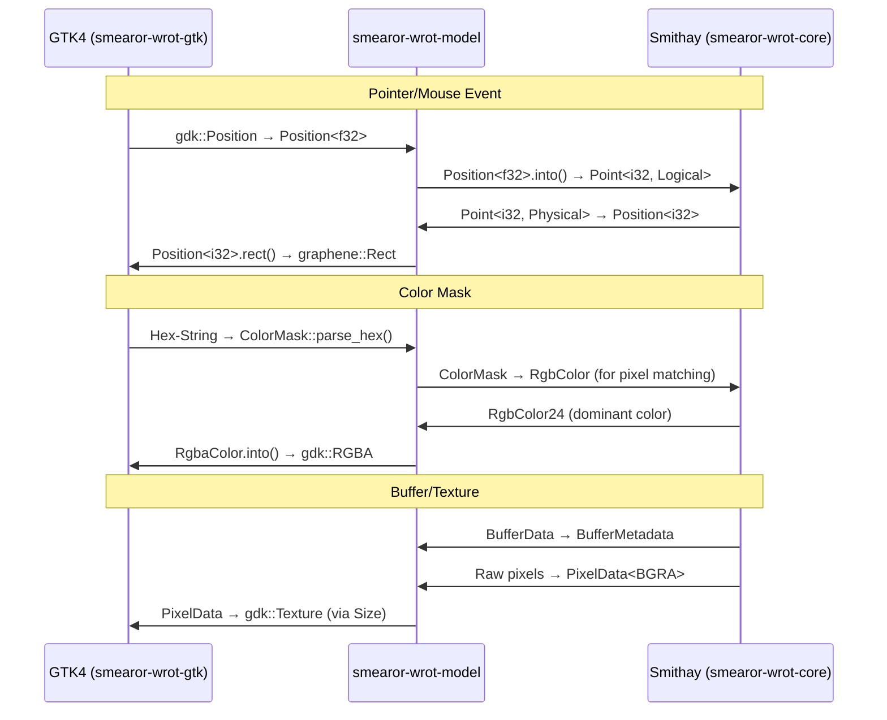

# smearor-wrot-model

## Overview

`smearor-wrot-model` is the centralized data model crate for the `smearor-wrot` workspace. It defines all shared types used across the compositor, GTK widget, application, pie menu, and wrapper crates. The crate is designed to be lightweight with no mandatory external dependencies — all framework integrations (GTK4, Smithay, image, serde) are optional via feature flags.

## Module Structure

| Module | Types | Description |
|--------|-------|-------------|
| `buffer` | `BufferMetadata` | Wayland buffer dimensions and stride metadata |
| `color` | `RgbColor`, `RgbColor24`, `RgbaColor`, `RgbaColor24`, `ColorMask`, `ColorFrequency` | Color types with hex parsing, conversions, and color masking |
| `config` | `DebugOverlayConfig`, `Config`, `WindowConfig`, `CompositorConfig`, `ConfigError` | Configuration structs for TOML-based config files |
| `geometry` | `Position<T>`, `Size<T>`, `Rectangle<T>` | Generic geometry primitives with arithmetic and conversions |
| `keyboard` | `KeyboardLayout` | Keyboard layout detection and representation |
| `margin` | `Margins` | Margin container for widget spacing |
| `menu` | `MenuItem` | Pie menu item with builder pattern, colors as `RgbaColor` |
| `message` | `CompositorMessage` | Messages sent from compositor core to GTK wrapper |
| `pointer` | `PointerPosition<T>` | Pointer/touch position tracking with debug overlay rendering |
| `socket` | `Socket` | Wayland socket path wrapper |
| `texture` | `PixelData<F>`, `BGRA`, `RGBA`, `PixelDataFormat` | Raw pixel data with format-specific conversions |

## Type Reference

### Color Types

#### `RgbColor`
- **Fields**: `red: f32`, `green: f32`, `blue: f32` (0.0–1.0)
- **Conversions**: `From<RgbColor24>`, `From<ColorMask>`, hex parsing via `FromStr`
- **Feature gates**: `From<smithay::utils::...>` (smithay)

#### `RgbaColor`
- **Fields**: `color: RgbColor`, `alpha: f32`
- **Conversions**: `From<RgbColor>` (alpha=1.0), `From<&str>` (hex), `From<String>`, `FromStr`, `From<RgbaColor24>`
- **Feature gates**: `From<gdk::RGBA>` / `Into<gdk::RGBA>` (gtk4)
- **Builder**: `TypedBuilder` with `setter(into)` accepting hex strings, `RgbColor`, or `RgbaColor`

#### `ColorMask`
- **Fields**: `color: RgbColor`, `tolerance: f32`
- **Conversions**: `From<ColorMask>` for `RgbColor`, hex parsing via `ToHex`
- **Methods**: `new()`, `with_default_tolerance()`, `clamp()`, `color()`, `tolerance()`

### Geometry Types

#### `Position<T>`
- **Fields**: `x: T`, `y: T`
- **Conversions**: `From<(T, T)>`, type conversions (`i32`→`f32`, `i32`→`u32`, `f64`→`f32`)
- **Feature gates**: `From<smithay::utils::Point>` (smithay), `rect()` → `gtk4::graphene::Rect` (gtk4)

#### `Size<T>`
- **Fields**: `width: T`, `height: T`
- **Conversions**: `From<(T, T)>`, type conversions
- **Feature gates**: `From<smithay::utils::Size>` (smithay), `From<gdk::Texture>` (gtk4)

#### `Rectangle<T>`
- **Fields**: `position: Position<T>`, `size: Size<T>`
- **Conversions**: `From<Position<T> + Size<T>>`
- **Feature gates**: `From<smithay::utils::Rectangle>` (smithay), `From<gtk4::graphene::Rect>` (gtk4)

### Buffer & Texture Types

#### `BufferMetadata`
- **Fields**: `width: i32`, `height: i32`, `stride: i32`
- **Feature gates**: `From<&smithay::wayland::shm::BufferData>` (smithay)

#### `PixelData<F>`
- **Formats**: `BGRA`, `RGBA` (marker types)
- **Methods**: `new()`, `from_slice()`, `is_zero()`, `into_rgba()`, `to_rgba()`, `replace_color()`, `apply_color_mask()`, `get_frequency_map()`, `get_dominant_color()`
- **Conversions**: `From<&PixelData<BGRA>>` for `PixelData<RGBA>` and vice versa
- **Feature gates**: `save_png()` (image)

### Config Types

#### `DebugOverlayConfig`
- **Fields**: `debug_pointer: bool`, `debug_touch: bool`
- **Always available** (no feature gate)

#### `Config` (serde feature)
- **Fields**: `window: WindowConfig`, `compositor: CompositorConfig`
- **Derives**: `Deserialize`, `Default`

#### `WindowConfig` (serde feature)
- All fields `Option<T>` for partial config files
- **Derives**: `Deserialize`, `Default`

#### `CompositorConfig` (serde feature)
- All fields `Option<T>` for partial config files
- **Derives**: `Deserialize`, `Default`

### Other Types

#### `CompositorMessage`
- **Derives**: `Debug`, `Clone`, `Serialize`, `Deserialize` (serde feature)
- **Variants**: `Resize`, `Maximize`, `Fullscreen`, `Minimize`, `Restore`, `Close`, `Shutdown`, `TitleChanged`, `WindowMapped`, `FirstCommit`, `WaylandSelectionChanged`, `MoveRequest`, `ResizeRequest`

#### `MenuItem`
- **Derives**: `TypedBuilder`, `Hash`, `Eq`, `PartialEq` (by `id`)
- **Color fields**: `label_color: RgbaColor`, `color: RgbaColor` (builder accepts `&str`, `RgbColor`, `RgbaColor` via `Into<RgbaColor>`)

#### `PointerPosition<T>`
- **Fields**: `gtk_pos`, `app_pos`, `size`, `gtk_color`, `app_color`, `border_width`
- **Feature gates**: `new_pointer()`, `new_touch()`, `gtk_rect()`, `app_rect()`, `render_snapshot()` (gtk4)

#### `Socket`
- **Wraps**: `PathBuf`
- **Traits**: `Deref<Target=Path>`, `AsRef<OsStr>`, `AsRef<str>`, `Display`, `From<PathBuf>`

#### `KeyboardLayout`
- **Fields**: `layout: String`, `variant: Option<String>`
- **Methods**: `full_name()`, `from_xkb_rule_names()` (regex feature)

#### `Margins`
- **Fields**: `left`, `right`, `top`, `bottom` (all `u32`)
- **Derives**: `Default`, `TypedBuilder`

## Conversion Matrix

| Source | Target | Trait | Feature |
|--------|--------|-------|---------|
| `RgbColor24` | `RgbColor` | `From` | — |
| `RgbColor` | `RgbColor24` | `From` | — |
| `RgbaColor24` | `RgbaColor` | `From` | — |
| `RgbaColor` | `RgbaColor24` | `From` | — |
| `RgbColor` | `RgbaColor` | `From` | — |
| `&str` (hex) | `RgbaColor` | `From` | — |
| `String` (hex) | `RgbaColor` | `From` | — |
| `ColorMask` | `RgbColor` | `From` | — |
| `RgbaColor` | `gdk::RGBA` | `From` | gtk4 |
| `gdk::RGBA` | `RgbaColor` | `From` | gtk4 |
| `Position<f32>` | `graphene::Rect` | `rect()` | gtk4 |
| `Size<u32>` | `gdk::Texture` | `From` | gtk4 |
| `Rectangle` | `graphene::Rect` | `From` | gtk4 |
| `Position<i32>` | `Point<i32, K>` | `From` | smithay |
| `Point<i32, K>` | `Position<i32>` | `From` | smithay |
| `Size<i32>` | `SSize<i32, K>` | `From` | smithay |
| `Rectangle<i32>` | `SRect<i32, K>` | `From` | smithay |
| `SRect<i32, K>` | `Rectangle<i32>` | `From` | smithay |
| `&BufferData` | `BufferMetadata` | `From` | smithay |
| `PixelData<BGRA>` | `PixelData<RGBA>` | `into_rgba()` / `to_rgba()` / `From` | — |
| `PixelData<RGBA>` | `PixelData<BGRA>` | `From` | — |
| `(&WindowConfig, &CompositorConfig)` | `CompositorWidgetConfig` | `From` | serde |

## Conversion Diagrams

### Color Conversions



### Geometry Conversions



### Buffer & Texture Conversions



### Crate Dependencies



### Data Flow: GTK ↔ Smithay via Model



## Feature Flags

| Feature | Description | Dependencies |
|---------|-------------|--------------|
| `gtk4` | GTK4 type conversions (`gdk::RGBA`, `graphene::Rect`, `gdk::Texture`) | `gtk4` |
| `smithay` | Smithay type conversions (`Point`, `Size`, `Rectangle`, `BufferData`) | `smithay` |
| `image` | PNG export via `PixelData::save_png()` | `image` |
| `serde` | Serialize/Deserialize for `Config`, `WindowConfig`, `CompositorConfig`, `CompositorMessage` | `serde` |
| `regex` | Keyboard layout detection from XKB rule names | `regex` |
| `default` | No features enabled by default | — |

## Examples

### Building a MenuItem with colors

```rust
use smearor_wrot_model::menu::MenuItem;
use smearor_wrot_model::color::RgbColor;

// Using hex strings
let item = MenuItem::builder()
    .id(1)
    .label("Close")
    .icon_name("window-close")
    .color("#FF0000")
    .label_color("#FFFFFF")
    .build();

// Using RgbColor
let item = MenuItem::builder()
    .id(2)
    .label("Open")
    .icon_name("document-open")
    .color(RgbColor::new(0.0, 1.0, 0.0))
    .build();
```

### Loading config from TOML

```rust
use smearor_wrot_model::config::Config;

let toml_content = r#"
[window]
title = "My App"
width = 800

[compositor]
opacity = 0.9
"#;
let config: Config = toml::from_str(toml_content)?;
```

### Converting pixel data

```rust
use smearor_wrot_model::texture::{PixelData, BGRA, RGBA};

let bgra = PixelData::<BGRA>::new(vec![10, 20, 30, 255]);
let rgba = bgra.to_rgba();  // copy, original preserved
let rgba2 = bgra.into_rgba(); // consumed, original destroyed
```

## Testing

Tests are inline in each source file under `#[cfg(test)] mod tests`. Feature-gated tests use `#[cfg(feature = "...")]`.

**Run tests:**
```sh
cargo test -p smearor-wrot-model
cargo test -p smearor-wrot-model --all-features
```

**Test coverage:**
- Color: `RgbColor`, `RgbaColor`, `ColorMask` — construction, conversions, hex parsing, clamping
- Geometry: `Position`, `Size`, `Rectangle` — arithmetic, type conversions, defaults, display
- Buffer: `BufferMetadata` — construction, display
- Texture: `PixelData` — empty/filled checks, frequency map, dominant color, BGRA↔RGBA conversion, PNG save
- Message: `CompositorMessage` — variant coverage, clone, debug, serde roundtrip
- Config: `DebugOverlayConfig`, `Config` — defaults, TOML deserialization
- Keyboard: `KeyboardLayout` — construction, display, clone
- Menu: `MenuItem` — builder, radius, hash/eq, colors as `RgbaColor`
- Margin: `Margins` — construction, default, display, builder
- Pointer: `PointerPosition` — construction, `new_pointer`/`new_touch`, `gtk_rect`/`app_rect` (gtk4)
- Socket: `Socket` — `From<PathBuf>`, `Deref`, `AsRef`, `Display`
