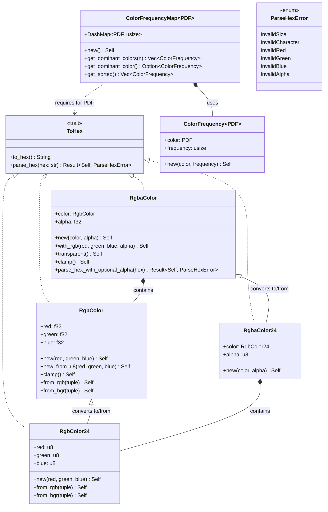

# smearor-wrot-color

A Rust library for color manipulation and frequency analysis. Provides RGB and RGBA color representations with support for hex encoding/decoding, color frequency tracking, and dominant color extraction.

## Summary

This library offers:

- **RGB Color Types**: `RgbColor` (f32 components, 0.0-1.0) and `RgbColor24` (u8 components, 0-255)
- **RGBA Color Types**: `RgbaColor` (f32 components with alpha) and `RgbaColor24` (u8 components with alpha)
- **Hex Encoding/Decoding**: Parse and convert colors to/from hex strings (e.g., `#FF8040`, `#FF804080`)
- **Color Frequency Tracking**: Track color occurrences with `ColorFrequencyMap`
- **Dominant Color Extraction**: Find the most frequent colors in a collection
- **Clamping**: Ensure color values stay within valid ranges
- **Format Conversions**: Support for RGB/BGR tuple conversions

## Conversion Possibilities

### Between RGB Types
- `RgbColor` ↔ `RgbColor24` (via `From` trait)
- `RgbColor` ↔ `(u8, u8, u8)` RGB tuple
- `RgbColor` ↔ `(u8, u8, u8)` BGR tuple
- `RgbColor24` ↔ `(u8, u8, u8)` RGB tuple
- `RgbColor24` ↔ `(u8, u8, u8)` BGR tuple

### Between RGBA Types
- `RgbaColor` ↔ `RgbaColor24` (via `From` trait)

### Hex Conversions
- `RgbColor` ↔ Hex string (`#RRGGBB`)
- `RgbColor24` ↔ Hex string (`#RRGGBB`)
- `RgbaColor` ↔ Hex string (`#RRGGBBAA`)
- `RgbaColor24` ↔ Hex string (`#RRGGBBAA`)
- `RgbaColor` can parse hex with optional alpha (falls back to alpha=1.0)

### Platform-Specific
- `RgbaColor` → `gdk::RGBA` (when `gtk4` feature is enabled)

## Type Hierarchy



## Usage Examples

### Basic Color Creation
```rust
use smearor_wrot_color::{RgbColor, RgbaColor};

// Create RGB color from f32 values
let rgb = RgbColor::new(0.5, 0.25, 0.75);

// Create RGB color from u8 values
let rgb = RgbColor::new_from_u8(128, 64, 192);

// Create RGBA color
let rgba = RgbaColor::with_rgb(0.5, 0.25, 0.75, 0.5);
```

### Hex Encoding/Decoding
```rust
use smearor_wrot_color::{RgbColor, RgbaColor, ToHex};

// Encode to hex
let rgb = RgbColor::new(1.0, 0.5, 0.25);
let hex = rgb.to_hex(); // "#FF8040"

// Decode from hex
let rgb = RgbColor::parse_hex("#FF8040").unwrap();

// RGBA with alpha
let rgba = RgbaColor::parse_hex("#FF804080").unwrap();
let rgba = RgbaColor::parse_hex_with_optional_alpha("#FF8040").unwrap(); // alpha = 1.0
```

### Color Frequency Analysis
```rust
use smearor_wrot_color::{RgbColor24, ColorFrequencyMap};

let mut map: ColorFrequencyMap<RgbColor24> = ColorFrequencyMap::new();
map.insert(RgbColor24::new(255, 0, 0), 100);
map.insert(RgbColor24::new(0, 255, 0), 50);

// Get dominant colors
let dominant = map.get_dominant_colors(2);
let top = map.get_dominant_color().unwrap();
```

## Features

- `gtk4`: Enables conversion to `gdk::RGBA` for GTK4 integration

## License

This project is part of the smearor-wrot workspace. See the workspace-level license file for details.
